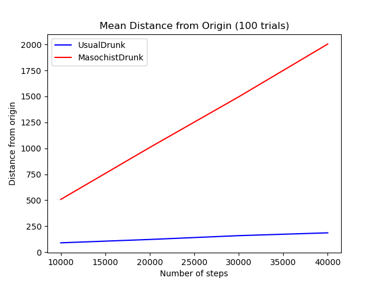

# Random Walks Simulation

## Tasks
1. simulate one walks of k steps
2. simulate n walks
3. report average distance from origin

## Simulations:

## References
- [MIT Course](https://ocw.mit.edu/courses/electrical-engineering-and-computer-science/6-0002-introduction-to-computational-thinking-and-data-science-fall-2016/index.htm)
- [Course Video](https://www.youtube.com/watch?v=6wUD_gp5WeE)